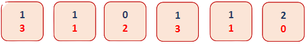
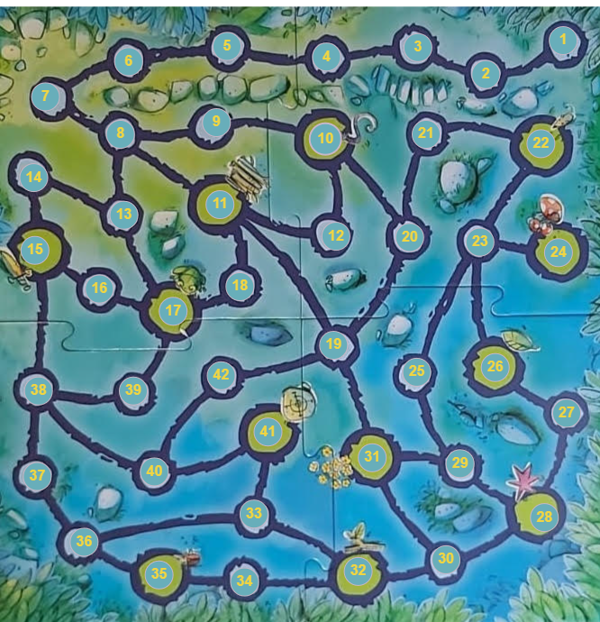
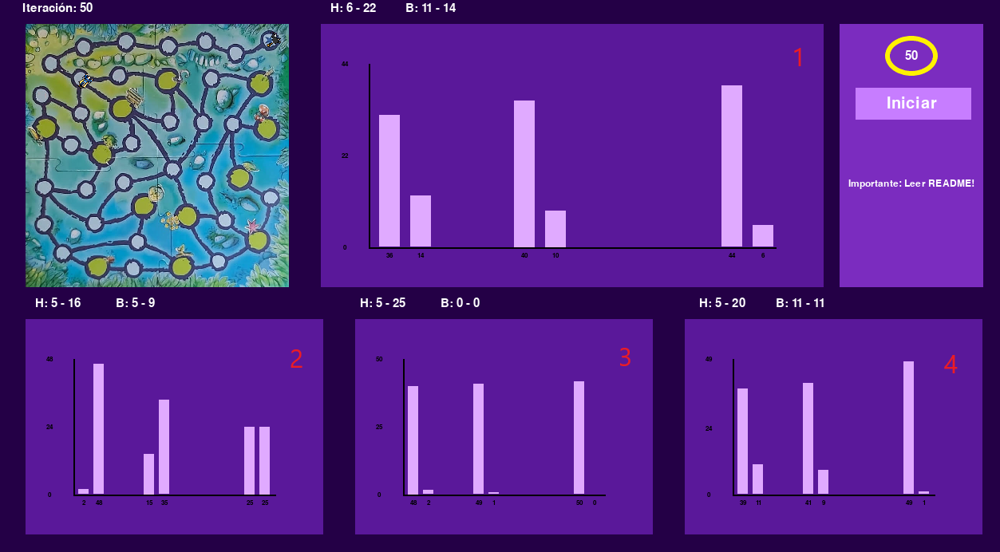

# La Torre Encantada

## Notas importantes
Proyecto universitario, basado en instrucciones dadas en el [archivo PDF](/Trabajo 3 - Torre Encantada.pdf) entregado por mi profesor.

## Requisitos

- Python
- Pygame

## Instalación

1. Asegúrate de que Python y Pygame estén instalados en tu sistema.
2. Clona este repositorio en tu máquina local.
3. Navega al directorio donde clonaste el repositorio.
4. Ejecuta `python main.py` para iniciar el juego.

## Detalles del Juego

### Visión General del Juego

"La Torre Encantada" Simula un juego por turnos donde una Bruja encierra a la princesa del Héroe, esta bruja esconde la llave que puede ser utilizada para rescatar a la princesa. El objetivo principal para el héroe es encontrar esta llave dentro del tablero, antes de que lo haga la bruja.

### Reglas del Juego

Existen 3 posiciones posibles donde la bruja esconde la llave al comienzo de cada partida, la bruja conoce también la posición de esta llave y avanza por turnos por el camino más corto hasta esta, el héroe por otro lado, sabe que la llave puede estar en una de las 3 posiciones, pero no exactamente en cual, esto implica que el héroe buscará en estos 3 lugares, avanzando hacia el más cercano hasta encontrar una bifurcación, donde este eligirá un camino al azar, sin la posibilidad de poder volver donde venía.

### Contenidos del Juego

El juego consta con un dado, donde los números rojos son pertenecientes al movimiento del héroe, mientras los azules, son los de la bruja.  

También consta de un mapa, representado por un Grafo dentro del código.  

### Requisitos del Proyecto

Este proyecto tiene la finalidad de un análisis sobre diferentes datos provenientes de las ejecuciones del juego:

1. **Simulación de Monte Carlo:** Se simulan una cantidad dada por usuario de iteraciones (por defecto 10).

2. **Posiciones de Inicio Distintas:** La simulación se ejecuta para tres escenarios diferentes: el héroe comienza en las posiciones del grafo 6, 7 y 8, mientras que la bruja siempre inicia en el 1.

3. **Resultados Esperados:** El análisis incluye determinar casos de éxito para el héroe y la bruja, el impacto de las modificaciones de los dados y el recuento máximo y mínimo de turnos para cada personaje.

4. **Modificación Propuesta:** El programa incluye una última ejecución con una modificación donde la bruja se distrae con 20% de probabilad, esto significa que al momento de distraerse, la bruja no realiza su movimiento, dándole una ventaja al héroe y asegurando de que el héroe ganará más del 50% de las veces.

### Pantalla de Visualización

Se muestran los datos de distintas maneras dentro del programa, ahora se explicarán que representa cada parte de la ventana de ejecución:  

1. Encerrado en amarillo, se ve la cantidad de iteraciones que realizará el programa.
2. Se ven 4 gráficos distintos, cada uno representando una modificación distinta, el gráfico márcado con un **1**, representa las reglas estándar del juego. Marcado con el número **2**, se ve el juego modificando los dados sumandole 1 a los números azules. En el número **3**, está la modificación de los dados, sumándole 1 a los números rojos. Finalmente en el número **4**, se ve la modificación propuesta.
3. Arriba de cada gráfico, se puede ver una letra *H* y una letra *B*, estas representan los movimientos mínimos y máximos para la victoria de el héroe y de la bruja, esto dentro de todas las iteraciones de cada modificación del juego. El primer número corresponde a los movimientos mínimos, y el segundo, los máximos, esto es igual para el *héroe(H)* y para la *bruja(B)*.

### Instrucciones de Uso

1. Al ejecutar el juego, se deberán elegir la cantidad de iteraciones totales, esto simplemente es escribiendo los números con el teclado, los cuales comenzarán a salir en pantalla.
2. Si no se elige una cantidad de iteraciones, o el número es inválido (se ingresó una letra o un símbolo), la cantidad de iteraciones quedará por defecto en 10.
3. 10 iteraciones tardan aprox ***~5.411*** segundos, esto implica que las 5000 iteraciones originales tardarían unos ***~45.09*** minutos. Recomiendo utilizar 500 iteraciones para visualizar correctamente todos los datos en los gráficos, esto tardaría aproximadamente ***~4.51*** minutos.
